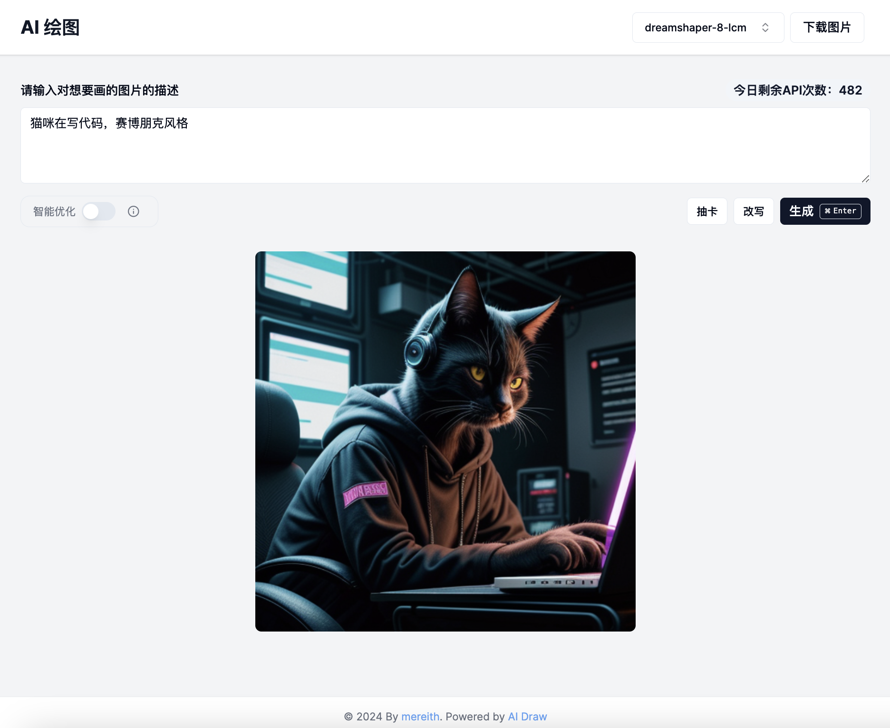

## AI Draw

可以自己部署的 AI 画图 web 应用，支持多种模型，只能改写 prompt，可以抽卡。

目前基于 cloudflare ai，后续支持多种后端。


> [在线体验地址](https://aidraw.mereith.com) （每日调用数有限）



## 功能
- 切换多个模型，目前有 `sd-xl-light` `sd-xl-base` `sd-1.5` `dreamshaper-lcm`
- 自动改写中文 prompt 到英文（通过文本大模型）
- 换一换，随机生成 prompt 抽卡（通过文本大模型）
- 智能改写，通过文本大模型把你的输入变得更详细。
- API 调用次数限制。

## 使用方法
### 关于费用
目前 cloudflare 的描述是 `beta` 的模型，每天免费 `1000 次`，恰好我用的也都是 `beta` 的，所以先白嫖着？

后面我会把基于 `comflowy` 后端的能力补上（其实已经有了，就是得改下）。

> 我加了 API 调用次数限制，每个功能花费如下：    
> 换一换：1次。   
> 改写：1次    
> 绘图：2次（prompt 处理 + 绘图）    
> 开了智能改写后绘图：3次    


### 前置
在 cloudflare 控制台创建一个 ai gateway，并获取 token

### docker 部署

```bash
docker run -d --name aidraw \
--restart unless-stopped \
-p 3000:3000 \
-e CLOUDFLARE_GATEWAY={你的 cf ai gateway 地址} \
-e CLOUDFLARE_API_TOKEN={你的 cf token} \
-e API_LIMIT_PREDAY={你想要的每天限制次数} \
mereith/ai-draw
```